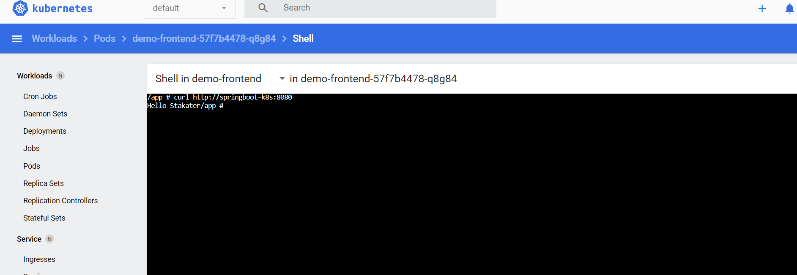
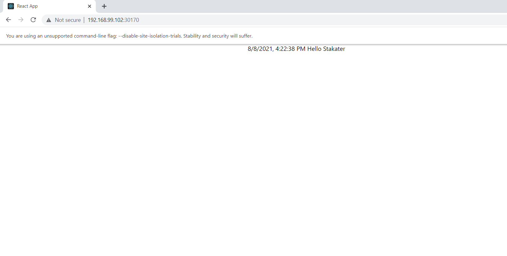

# demo-frontend

Build a docker Image
> docker build -t shadabgada/demo-ui:1.0 .

Push to docker hub
> docker push shadabgada/demo-ui:1.0

 

### Kubernetes setup

1. Set virtualbox config variable
    > minikube config set vm-driver virtualbox

2. Start minikube
    > minikube start

3. check status
    > minikube status

4. view minikube dashboard
    > minikube dashboard

5. Clone both the repositories
    - https://github.com/shadabgada/demo-backend
    - https://github.com/shadabgada/demo-frontend

6. Goto demo-backend/kubernetes/ and run below command
    > kubectl apply -f deployment.yml

7. Goto demo-frontend/kubernetes/ and run below command
    > kubectl apply -f deployment.yml

8. Run below command to enable ingress controller
    > minikube addons enable ingress

9. You can use below commands to check POD, services or ingress status/details
    - kubectl get pods
    - kubectl get services
    - kubectl get ingress

10. Run frontend services on your machine
    > minikube service demo-frontend

    Here, we will just see the frontend message and not the backend message. I have explained its reason and solution [below](#way-2)

10. Run backend services on your machine
    > minikube service springboot-k8s

 

### In frontend POD we can access backend API in two ways, I have added both the ways

### Way 1: 

Goto Fronted POD and run below command
> curl http://springboot-k8s:8080

where 'springboot-k8s' is the Backend POD exposing its rest API

Output screenshot:

### Way 2:

If we want to access the frontend on our browser, we need to work around below two problems
- 1. Frontend will make a call to backend POD url that is not accessible in browser, hence it does not display backend response.
- 2. As we are running both frontend and backend on same machine(i.e. localhost) we might face Chromes CORS issue.

To resolve first issue I have added Ingress controller. The IP of ingress and corresponding host name are then added to /etc/hosts file. For details, [you can visit here](https://kubernetes.io/docs/tasks/access-application-cluster/ingress-minikube/)

For second issue, run below command to open Google chrome and enter the frontend url which we want to access

> chrome.exe  --disable-site-isolation-trials --disable-web-security --user-data-dir="D:\temp"

 This solution will start chrome in an isolated sandbox and it will not affect the main chrome profile.

 Output screenshot:

